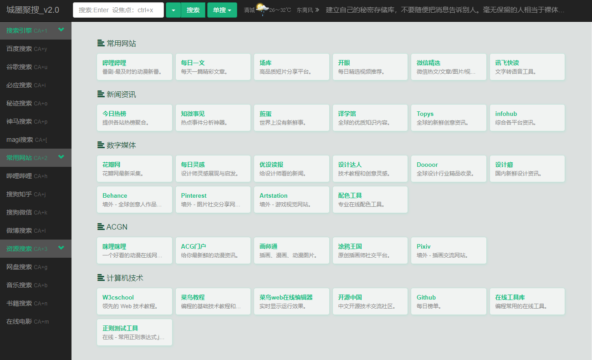
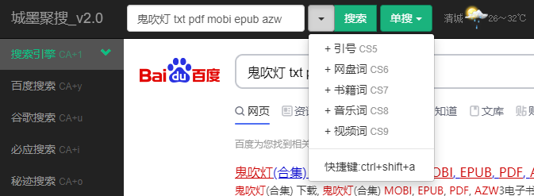
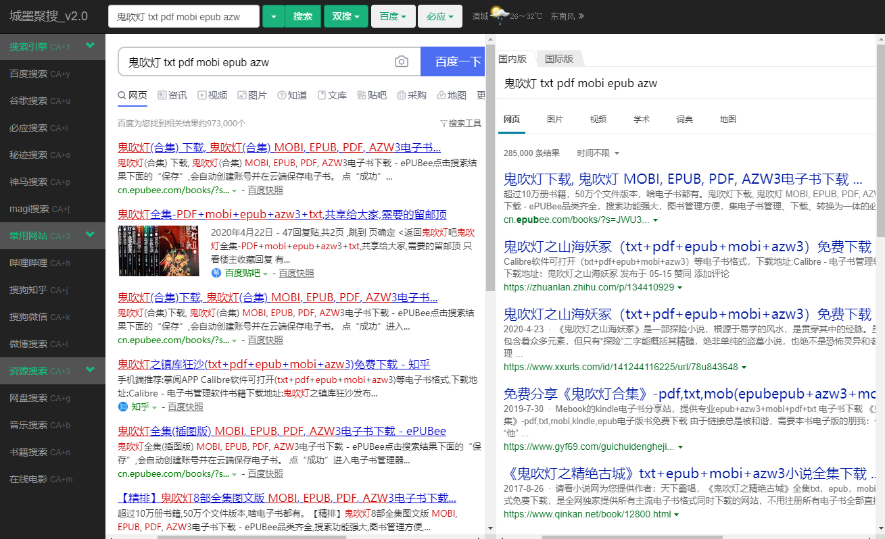

# 说明

**一个下载即用的聚合搜索网页。**

# 为什么做这个网页

我在网上搜索资料的时候，经常要切换不同的网站，以便**更快的找到更合适的资料**。但是在不同的网站切换是比较麻烦的，而且关键词还要自己手动复制粘贴一遍，感觉很不爽。

所以就做了这个聚合搜索网页，**关键词只需要输入一次**，然后点击左侧的列表来切换不同的搜索引擎就行了。**而且还可以两三个搜索引擎同时用**。

PS：这个网页我是一边学一边做的，所以可能有很多地方做得不好，大家将就一下。:smirk:

# 功能介绍

## 1.提供了一个默认导航页面

大家可以自己修改成自己常用的网站。(文件是`defaultPage.html`)

## 2.添加预设的词

## 3.快速切换搜索引擎

直接点击左侧的搜索引擎就能切换了。当然也可以直接**按快捷键**(后面有快捷键的说明)。

## 4.同时用两个搜索引擎

## 5.同时用三个搜索引擎

# 快捷键说明

大家应该也看到搜索引擎后面跟着一些字母了，那些就是快捷键。为了更加高效，我给大多数选项都加快捷键。

PS：焦点必须在顶部或者左侧的黑色区域的时候快捷键才能用。也就是说，假如你发现快捷键不能用了，那么你就点击一下左侧或者顶部的黑色区域的任意一处即可。

## 快捷键缩写

**大写字母的含义：**

C = ctrl

S = shift

A = alt

**小写字母的含义：**

就是表示正常的按键，比如说：y就是键盘上的y。

## 隐藏的按键

crtl+q：显示/隐藏左侧栏
